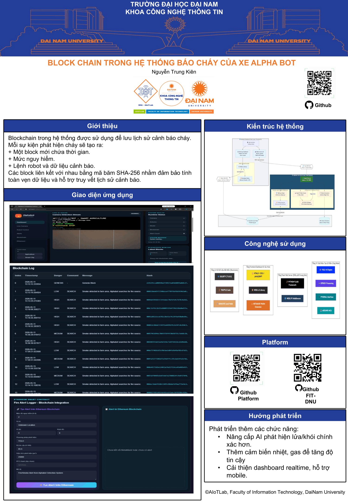

# Alphabot Firefighting Web System

## 1. Giới thiệu dự án

Alphabot Firefighting Web System là hệ thống robot chữa cháy thông minh sử dụng camera, xử lý ảnh, điều khiển Arduino, lưu cảnh báo bằng blockchain local và đồng bộ dữ liệu cảnh báo lên smart contract thông qua MetaMask.

Hệ thống gồm các chức năng chính:

* Phát hiện lửa và khói từ camera bằng YOLO hoặc HSV fallback.
* Điều khiển robot Alphabot thông qua Arduino.
* Hiển thị camera thời gian thực trên web.
* Gửi lệnh robot từ giao diện web.
* Lưu cảnh báo vào `blockchain_log.json`.
* Lưu lịch sử cảnh báo vào `fire_alert_history.txt`.
* Hiển thị blockchain local trên dashboard.
* Kết nối ví MetaMask bằng `ethers.js`.
* Ghi cảnh báo mới nhất hoặc toàn bộ cảnh báo lên smart contract Solidity.

---

## 2. Công nghệ sử dụng

### Backend

* Python
* Flask
* OpenCV
* NumPy
* PySerial
* Requests
* Ultralytics YOLO

### Frontend

* HTML
* CSS
* JavaScript
* ethers.js
* MetaMask

### Blockchain

* Blockchain local bằng file JSON
* Solidity smart contract
* Remix IDE
* MetaMask
* Sepolia Testnet hoặc mạng EVM tương thích

---

## 3. Cấu trúc thư mục

```text
BTL_03/
├── app.py
├── requirements.txt
├── README.md
├── blockchain_log.json
├── fire_alert_history.txt
├── fire_smoke.pt
├── alerts/
│   └── alert_images.jpg
├── contracts/
│   └── FireAlertLog.sol
├── templates/
│   └── index.html
└── static/
    ├── style.css
    ├── app.js
    └── wallet.js
```

Ghi chú:

* `app.py`: Backend Flask, xử lý camera, điều khiển Arduino, API, blockchain local.
* `templates/index.html`: Giao diện dashboard.
* `static/style.css`: Giao diện CSS.
* `static/app.js`: JavaScript cho dashboard, trạng thái hệ thống, lệnh robot, blockchain local.
* `static/wallet.js`: JavaScript kết nối MetaMask và smart contract.
* `contracts/FireAlertLog.sol`: Smart contract lưu cảnh báo lên blockchain.
* `blockchain_log.json`: Chuỗi block local.
* `fire_alert_history.txt`: Lịch sử cảnh báo dạng text.
* `alerts/`: Thư mục lưu ảnh cảnh báo.
* `fire_smoke.pt`: Model YOLO phát hiện lửa/khói. Nếu không có file này, hệ thống dùng HSV fallback.

---

## 4. Cài đặt môi trường

Mở terminal tại thư mục `BTL_03`.

### Windows

```bash
python -m venv venv
venv\Scripts\activate
pip install -r requirements.txt
```

### macOS / Linux

```bash
python3 -m venv venv
source venv/bin/activate
pip install -r requirements.txt
```

---

## 5. File requirements.txt

Nội dung file `requirements.txt`:

```text
flask
opencv-python
numpy
pyserial
requests
ultralytics
```

Nếu máy yếu hoặc không dùng YOLO, vẫn có thể cài đặt và chạy HSV fallback. Tuy nhiên, nếu không cài `ultralytics`, hệ thống vẫn có thể chạy nhờ phần `try/except` trong `app.py`.

---

## 6. Chạy hệ thống web

Sau khi cài đặt xong, chạy:

```bash
python app.py
```

Mở trình duyệt:

```text
http://127.0.0.1:5000
```

Nếu giao diện không cập nhật CSS/JS, bấm:

```text
Ctrl + F5
```

---

## 7. Cấu hình camera

Mặc định hệ thống dùng camera số 0:

```text
CAMERA_SOURCE=0
```

Nếu camera không mở được, thử đổi sang camera khác.

### Windows

```bash
set CAMERA_SOURCE=1
python app.py
```

### macOS / Linux

```bash
CAMERA_SOURCE=1 python app.py
```

Nếu vẫn lỗi camera:

* Kiểm tra webcam có đang bị ứng dụng khác sử dụng không.
* Kiểm tra quyền truy cập camera.
* Thử đổi `CAMERA_SOURCE=0`, `CAMERA_SOURCE=1`, `CAMERA_SOURCE=2`.

---

## 8. Cấu hình Arduino

Mặc định Arduino dùng cổng:

```text
COM3
```

Nếu Arduino của bạn ở cổng khác, ví dụ `COM5`, chạy:

```bash
set ARDUINO_PORT=COM5
python app.py
```

Trên macOS / Linux:

```bash
ARDUINO_PORT=/dev/ttyUSB0 python app.py
```

hoặc:

```bash
ARDUINO_PORT=/dev/ttyACM0 python app.py
```

Nếu Arduino chưa kết nối, hệ thống vẫn chạy ở chế độ mô phỏng. Các lệnh robot sẽ được in ra terminal:

```text
[ALPHABOT COMMAND] FORWARD
[ALPHABOT COMMAND] PUMP
[ALPHABOT COMMAND] STOP
```

---

## 9. Các lệnh điều khiển robot

Hệ thống hỗ trợ các lệnh:

* `FORWARD`
* `BACKWARD`
* `LEFT`
* `RIGHT`
* `PUMP`
* `SEARCH`
* `STOP`

Trên web có các nút điều khiển:

* `LEFT`: Rẽ trái.
* `FORWARD`: Tiến lên.
* `RIGHT`: Rẽ phải.
* `BACK`: Lùi lại.
* `PUMP`: Bật bơm nước.
* `SEARCH`: Tìm nguồn cháy.
* `STOP`: Dừng robot.
* `AUTO MODE`: Quay lại chế độ tự động.

Khi bấm một nút điều khiển, hệ thống chuyển sang `MANUAL`.

Khi bấm `AUTO MODE`, hệ thống quay lại tự động điều khiển dựa trên kết quả phát hiện lửa/khói.

---

## 10. Cơ chế phát hiện lửa/khói

Hệ thống có hai cơ chế phát hiện:

### 10.1. YOLO custom model

Nếu trong thư mục có file:

```text
fire_smoke.pt
```

hệ thống sẽ dùng YOLO để phát hiện các class:

* `fire`
* `smoke`

### 10.2. HSV fallback

Nếu không có `fire_smoke.pt`, hệ thống sẽ dùng HSV fallback.

HSV fallback phát hiện:

* Vùng màu đỏ, cam, vàng có khả năng là lửa.
* Vùng xám/trắng có khả năng là khói.
* Chỉ xét vùng ROI phía dưới khung hình để giảm nhiễu.

---

## 11. Blockchain local

Hệ thống lưu cảnh báo vào file:

```text
blockchain_log.json
```

Mỗi cảnh báo sẽ được ghi thành một block gồm:

```json
{
  "index": 1,
  "timestamp": "2026-01-01 12:00:00",
  "data": {
    "time": "2026-01-01 12:00:00",
    "mode": "agriculture",
    "danger_level": "HIGH",
    "robot_command": "PUMP",
    "message": "Fire detected in farm area.",
    "image_path": "alerts/alert_20260101_120000.jpg",
    "detections": []
  },
  "previous_hash": "...",
  "nonce": 1234,
  "hash": "..."
}
```

Blockchain local có cơ chế:

* Genesis block.
* Tính SHA-256 hash.
* Liên kết `previous_hash`.
* Mine block với `difficulty = 3`.
* Validate chain.

---

## 12. Smart contract Solidity

File contract nằm tại:

```text
contracts/FireAlertLog.sol
```

Contract dùng để lưu hash cảnh báo từ blockchain local lên blockchain thật.

Nội dung contract cần bắt đầu bằng:

```solidity
// SPDX-License-Identifier: MIT
pragma solidity ^0.8.20;
```

Các hàm chính:

* `storeAlert(...)`
* `getAlert(uint256 id)`
* `getLatestAlert()`
* `alertCount()`
* `hashExists(string memory hash)`

---

## 13. Deploy smart contract bằng Remix

Mở Remix IDE:

```text
https://remix.ethereum.org
```

Các bước:

1. Tạo file `FireAlertLog.sol`.
2. Dán code smart contract.
3. Mở tab Solidity Compiler.
4. Chọn compiler `0.8.20` hoặc mới hơn.
5. Bấm `Compile FireAlertLog.sol`.
6. Mở tab Deploy & Run Transactions.
7. Chọn Environment:

   * `Injected Provider - MetaMask`
8. Chọn mạng Sepolia trong MetaMask.
9. Bấm `Deploy`.
10. Copy địa chỉ contract sau khi deploy.

Ví dụ contract address:

```text
0x1234567890abcdef1234567890abcdef12345678
```

---

## 14. Cấu hình MetaMask trong wallet.js

Mở file:

```text
static/wallet.js
```

Tìm dòng:

```javascript
const FIRE_ALERT_CONTRACT_ADDRESS = "DAN_DIA_CHI_CONTRACT_CUA_BAN_VAO_DAY";
```

Thay bằng địa chỉ contract thật:

```javascript
const FIRE_ALERT_CONTRACT_ADDRESS = "0x1234567890abcdef1234567890abcdef12345678";
```

Sau đó reload web:

```text
Ctrl + F5
```

---

## 15. Kết nối MetaMask trên web

Trên dashboard:

1. Bấm `Connect MetaMask`.
2. Chọn tài khoản ví.
3. Cho phép kết nối.
4. Kiểm tra trạng thái ví trên panel Web3.

Nếu chưa có alert local:

1. Bấm `Test Alert`.
2. Hệ thống sẽ tạo một cảnh báo local.
3. Cảnh báo được ghi vào `blockchain_log.json`.

Sau đó:

* Bấm `Sync Latest Alert` để ghi cảnh báo mới nhất lên smart contract.
* Bấm `Sync All Alerts` để đồng bộ toàn bộ cảnh báo local chưa có trên contract.

---

## 16. ethers.js

Web sử dụng `ethers.js` thông qua CDN trong `templates/index.html`:

```html
<script src="https://cdn.jsdelivr.net/npm/ethers@6.13.4/dist/ethers.umd.min.js"></script>
<script src="{{ url_for('static', filename='app.js') }}"></script>
<script src="{{ url_for('static', filename='wallet.js') }}"></script>
```

`wallet.js` sử dụng:

```javascript
provider = new ethers.BrowserProvider(window.ethereum);
signer = await provider.getSigner();

fireContract = new ethers.Contract(
  FIRE_ALERT_CONTRACT_ADDRESS,
  FIRE_ALERT_ABI,
  signer
);
```

---

## 17. Các API backend chính

### Trang chính

```http
GET /
```

Hiển thị dashboard.

### Stream camera

```http
GET /video_feed
```

Trả về MJPEG stream từ OpenCV.

### Trạng thái hệ thống

```http
GET /api/status
```

Trả về trạng thái camera, Arduino, model, danger level, command, blockchain.

### Blockchain local

```http
GET /api/blockchain
```

Trả về toàn bộ `blockchain_log.json`.

### Lịch sử cảnh báo

```http
GET /api/alerts
```

Trả về dữ liệu từ `fire_alert_history.txt`.

### Gửi lệnh robot

```http
POST /api/command
```

Body:

```json
{
  "command": "FORWARD"
}
```

### Chuyển về AUTO

```http
POST /api/auto
```

### Đổi mode

```http
POST /api/mode
```

Body:

```json
{
  "mode": "agriculture"
}
```

hoặc:

```json
{
  "mode": "smart_city"
}
```

### Test alert

```http
POST /api/simulate_alert
```

Tạo cảnh báo giả lập để kiểm tra blockchain local và smart contract.

---

## 18. Cấu hình Telegram

Không nên hard-code token trong source code. Nên dùng biến môi trường.

### Windows

```bash
set ENABLE_TELEGRAM=true
set TELEGRAM_BOT_TOKEN=your_bot_token
set TELEGRAM_CHAT_ID=your_chat_id
python app.py
```

### macOS / Linux

```bash
ENABLE_TELEGRAM=true TELEGRAM_BOT_TOKEN=your_bot_token TELEGRAM_CHAT_ID=your_chat_id python app.py
```

---

## 19. Cấu hình Email

Dùng Gmail App Password, không dùng mật khẩu Gmail thường.

### Windows

```bash
set ENABLE_EMAIL=true
set EMAIL_SENDER=your_email@gmail.com
set EMAIL_PASSWORD=your_gmail_app_password
set EMAIL_RECEIVER=receiver@gmail.com
python app.py
```

### macOS / Linux

```bash
ENABLE_EMAIL=true EMAIL_SENDER=your_email@gmail.com EMAIL_PASSWORD=your_gmail_app_password EMAIL_RECEIVER=receiver@gmail.com python app.py
```

---

## 20. Lỗi thường gặp

### 20.1. Giao diện bị trắng, không có CSS

Nguyên nhân thường là sai thư mục `static` hoặc sai link CSS.

Kiểm tra cấu trúc:

```text
BTL_03/
├── app.py
├── templates/
│   └── index.html
└── static/
    ├── style.css
    ├── app.js
    └── wallet.js
```

Trong `index.html` phải có:

```html
<link rel="stylesheet" href="{{ url_for('static', filename='style.css') }}" />
```

và cuối file có:

```html
<script src="{{ url_for('static', filename='app.js') }}"></script>
```

Sau đó bấm:

```text
Ctrl + F5
```

### 20.2. Camera không mở được

Thông báo có thể là:

```text
Cannot open camera
```

Cách xử lý:

```bash
set CAMERA_SOURCE=1
python app.py
```

hoặc thử:

```bash
set CAMERA_SOURCE=2
python app.py
```

### 20.3. Arduino không kết nối

Nếu thấy:

```text
[SIMULATION] Arduino not connected.
```

Nghĩa là web vẫn chạy, nhưng chưa gửi được lệnh thật xuống Arduino.

Cách xử lý:

* Kiểm tra cổng COM trong Arduino IDE.
* Kiểm tra dây USB.
* Đóng Serial Monitor nếu đang mở.
* Chạy lại với đúng cổng:

```bash
set ARDUINO_PORT=COM5
python app.py
```

### 20.4. Remix báo thiếu SPDX hoặc pragma

Thêm 2 dòng này lên đầu file `.sol`:

```solidity
// SPDX-License-Identifier: MIT
pragma solidity ^0.8.20;
```

### 20.5. MetaMask không hiện

Kiểm tra:

* Đã cài extension MetaMask chưa.
* Đã thêm script ethers chưa.
* Đã thêm `wallet.js` chưa.
* Đã dán contract address thật chưa.

Trong `index.html` cần có:

```html
<script src="https://cdn.jsdelivr.net/npm/ethers@6.13.4/dist/ethers.umd.min.js"></script>
<script src="{{ url_for('static', filename='app.js') }}"></script>
<script src="{{ url_for('static', filename='wallet.js') }}"></script>
```

### 20.6. Lỗi contract address

Nếu thấy thông báo:

```text
Bạn chưa dán địa chỉ contract vào file static/wallet.js
```

Hãy mở `static/wallet.js`, thay:

```javascript
const FIRE_ALERT_CONTRACT_ADDRESS = "DAN_DIA_CHI_CONTRACT_CUA_BAN_VAO_DAY";
```

bằng địa chỉ thật sau khi deploy contract.

### 20.7. Không sync được alert lên contract

Kiểm tra:

* MetaMask đã connect chưa.
* Đang ở đúng mạng đã deploy contract chưa.
* Ví có Sepolia ETH để trả phí gas chưa.
* Địa chỉ contract đã đúng chưa.
* Đã có alert local chưa.

Có thể tạo alert test bằng nút:

```text
Test Alert
```

Sau đó bấm:

```text
Sync Latest Alert
```

---

## 21. Quy trình chạy đầy đủ

Thứ tự chạy đề xuất:

1. Cắm camera.
2. Cắm Arduino.
3. Chạy backend:

```bash
python app.py
```

4. Mở web:

```text
http://127.0.0.1:5000
```

5. Kiểm tra camera stream.
6. Kiểm tra lệnh robot.
7. Bấm `Test Alert`.
8. Kiểm tra `blockchain_log.json`.
9. Deploy contract `FireAlertLog.sol` bằng Remix.
10. Dán contract address vào `static/wallet.js`.
11. Bấm `Connect MetaMask`.
12. Bấm `Sync Latest Alert`.

---

## 22. Ghi chú bảo mật

Không đưa các thông tin sau lên GitHub công khai:

* Telegram bot token.
* Telegram chat ID.
* Gmail app password.
* Private key ví.
* Seed phrase MetaMask.

Frontend chỉ được chứa:

* Contract address.
* ABI.
* Logic gọi contract.

Không bao giờ đưa private key vào `wallet.js`.

---

## 23. Poster Đề Tài



---

## 24. Tác giả / Mục đích

Dự án dùng cho bài tập lớn / đồ án hệ thống robot chữa cháy thông minh Alphabot, kết hợp xử lý ảnh, IoT, web dashboard và blockchain.
